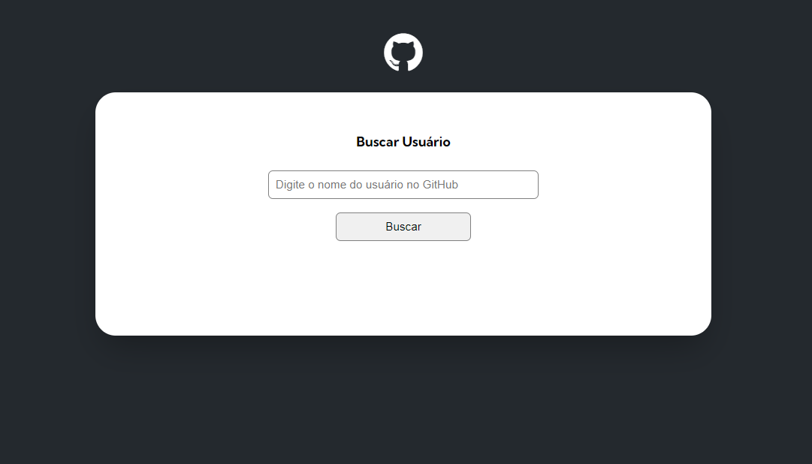

# Projeto Github API
Um projeto com HTML, CSS e Javascript proposto pelo curso DevQuest.

[]

## Tecnologias utilizadas
- HTML
- CSS
- Javascript

## O desafio
O desafio proposto pelo curso Devquest, consiste em usar a API do Github para buscar seu usuário, filtrando seus dados na tela.

## Desenvolvimento Contínuo 
Desde então continuarei desenvolvendo projetos com HTML, CSS, Javascript e logo trarei projetos mais complexos.
